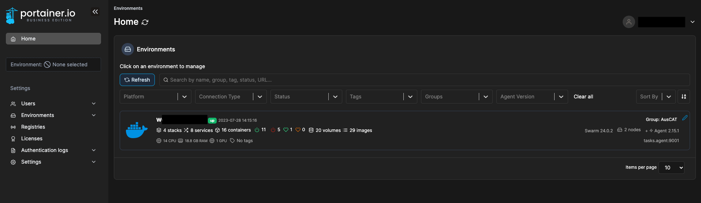
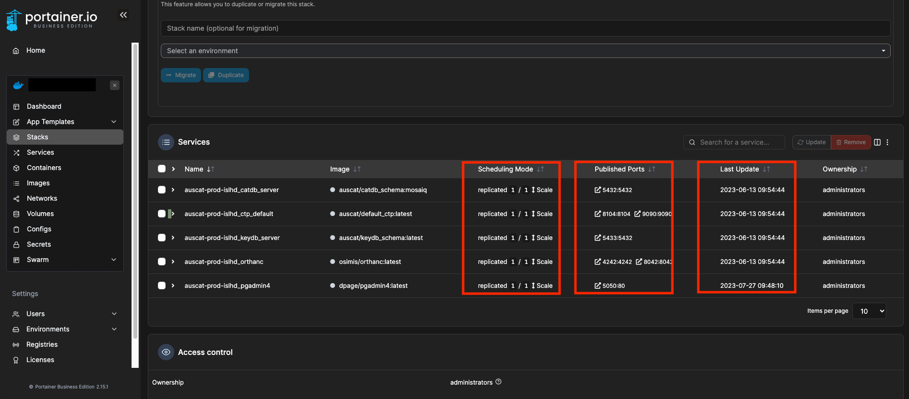
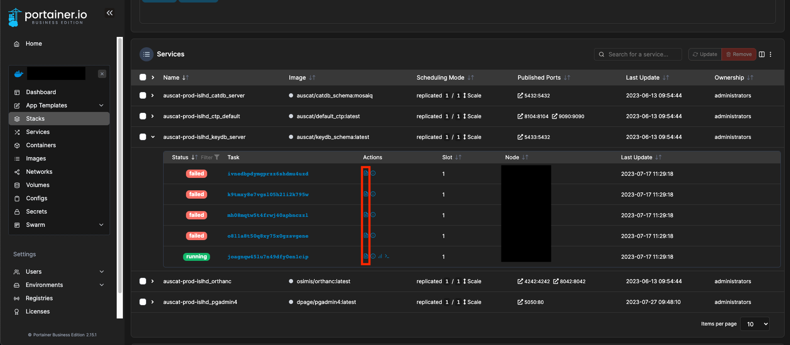
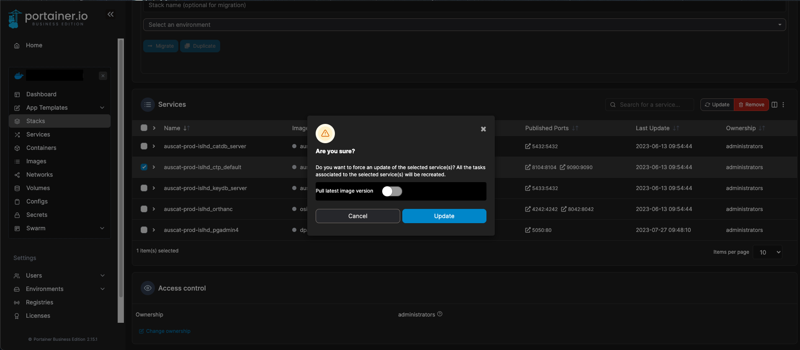
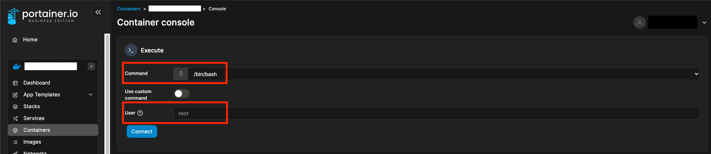

# Portainer: Tips and Tricks

This guide provides a quick summary of the best way to use Portainer for AusCAT related tasks such as deployment of AusCAT Docker stacks, interactively inspecting containers and rapidly updating Docker container with the latest images.
## Home Page  

On the left-hand side, you can click on the `Home` button and see an overview of your environments along with vital statistics about each.

For example, In AusCAT, you will see a Docker icon as the primary environment, it shows the number of Docker stacks, services, containers, volumes etc., on the host machine.

Your currently selected environment will be shown by the connected Status on the right. Typically, one environment will be configured for your AusCAT node, but multiple instances are possible if other Docker Swarm agents are deployed across different VMs at your site. We'll assume only one environemnt is configured as this is the most likely case across the AusCAT network.

## Stacks  

This section can be used to deploy new AusCAT stacks (for testing or production purposes), without the need for using the command line to deploy any of the AusCAT tools. 

### Add a new Stack 

When creating a new Stack, we typically use the `Web editor` build method which allows us to paste into the editor a Docker Compose YAML configuration of a stack we'd like to deploy. You can find the YAML template that we use for AusCAT Docker stack [here](https://github.com/AustralianCancerDataNetwork/auscat_installation/blob/main/docker-compose.yml), which can be copied and pasted into this editor box.

> Note: We recommend saving the YAML that you use in this Portainer setup somewhere on your system (eg. on the same VM's file system or your secure shared drive), as Portainer does not persist these YAML's. Subsequently, if you do save the YAML configuration into a `.yml` file, you can use the `Upload` build method to build your stacks from that same file rather than copy/pasting it into the Web editor.

### Inspecting Stacks 

Once a Stack has been deployed, monitoring its services' status is quite convenient through Portainer. Here is an example of a deployed AusCAT production stack:

From here we can quickly identify if services are running (under the Scheduling Mode column), on which ports the different services have been published and the last updated time for each service. Also, if a service is not running (eg. replicated `0/1` Scale`), we can click on the dropdown for that service and inspect its Logging output (highlighted in Red below) to debug the issue:

### Updating Services

From this Stacks section, updating services is straightforward. You can select the services that you wish to update using the checkbox on the far left of the menu and then clicking on `Update`. This will prompt you with the following:

If you wish to update the service with the latest image that can be pulled from the source registry into your agent's local registry, then make sure to toggle the `Pull latest image version` option. Otherwise, if you would like to simply refresh the service's container with no image update, do not select this option.

## Containers 

This page shows a list of all containers on the host agent. Unlike the `Stacks` and `Services` pages, this shows all containers that are on the host, not only ones that are bundled into a Stack. This includes active containers (`running` in green), stopped containers (`exited` in red) or newly booted containers that are setting up (`created` in blue).

Each container comes with the option of jumping into a interactive secure shell (`>_` icon under the `Quick Actions` column). This is extremely helpful for inspecting things inside of the container like checking if mounting paths are set correctly, or inspecting data that is encapsulted within the container environment and be only be accessed from within it. By default, you login as a root user into a Bash shell with sudo permissions, but this can be configured to another user and different shell or command that exists wihtin the container (highlighted in red):

## GPU configuration through Portainer

A limitation with Portainer Stacks is the inability to deploy services attached to GPUs. This is problematic for AusCAT projects such as the Cardiac Dosimetry Comparison where a GPU speeds up the auto segmentation process significantly.

A work around is to get a single *container* setup with GPU utilisation, rather than configuring an entire stack as Portainer allows individual containers to be setup with one. A limitation with this is if your service requires other services to be deployed along with it to run smoothly, then you'll have a disjoint between the 2 as each will now need to be deployed separately and manually inspected to confirm that they're both running. 

To do this:
- Access the `Containers` section on Portainer
- Click on the `Add container` blue button
- Configure your container with an approriate name, image, network ports configuration.
> Note: All the configurations that you'll set in the YAML for when you deploy your service using a stack will need to be configured in this section (eg. environment variables, secrets, volumes, networking, etc...)
- Scroll down to the `Advanced container settings` and configure other options you need accordingly. Most likely you'll need:
    * `Volumes`: setup any volume management that you'll need. You can configure a Docker Volume or a bind mount depending on your need service needs.
    * `Env`: configure environment variables here.
- For the GPU:
    * `Runtime & Resources`: here is where the GPU utilisation is configured for the container. Toggle under the GPU heading the `Enable GPU` option, next to it you can specifiy which of the GPU's (if there are mutiple instances running) that the container may utilise. By default, the "Use all GPUs" option will be provided.
- Once all the configuration options have been set, click on the `Deploy the container` blue button to deploy the container which can utilise the configured GPU/s.
