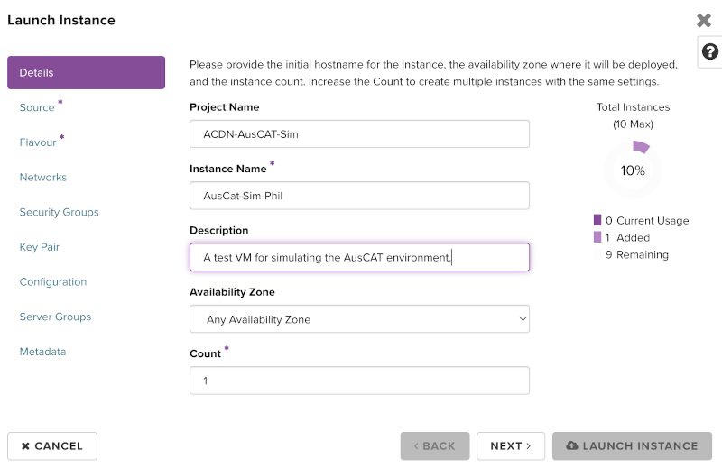
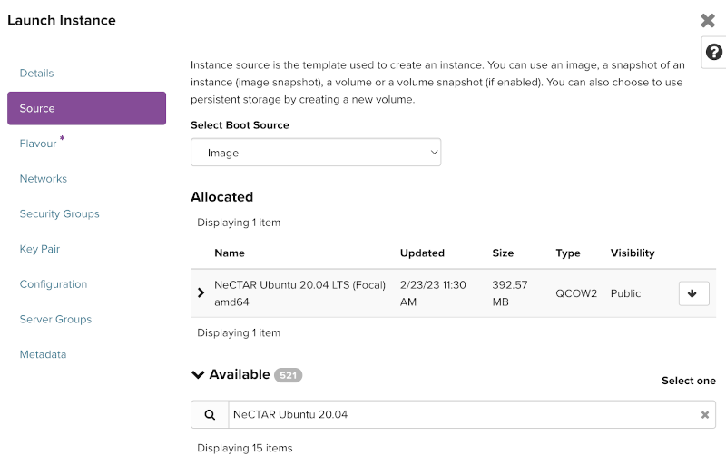
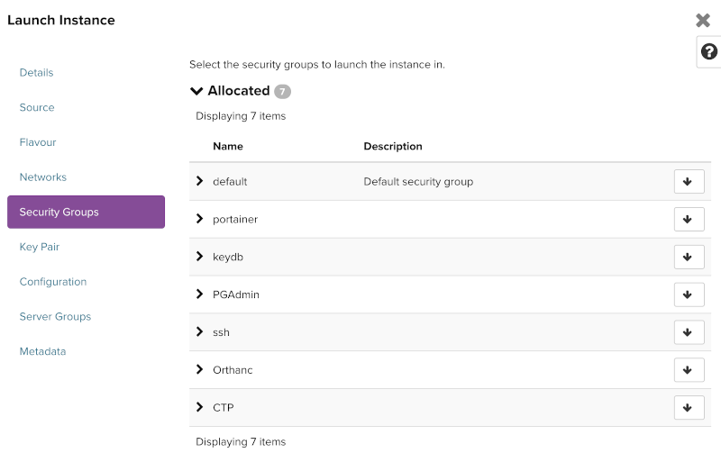
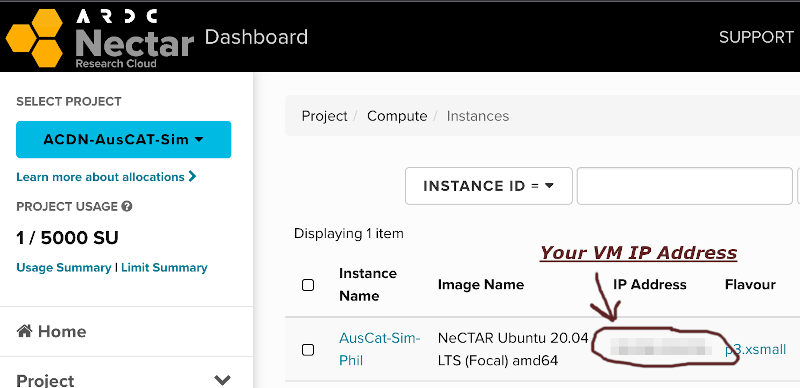

# NECTAR Virtual Machine Setup

You may want to setup a Virtual Machine to run in the NECTAR cloud to run the [AusCAT Simulation Environment](https://github.com/AustralianCancerDataNetwork/auscatverse/blob/main/guides/SIMULATION.md). The ACDN has a project on NECTAR cloud with some credits to run the simulation environment for development, educational and testing purposes.

Note that you will need a University affiliated account and access to `ACDN-AusCAT-Sim` project (if intending to use NECTAR cloud). Contact the AusCAT technical team for access to the ACDN NECTAR project.

## Instance Creation Steps

Perform the following steps to setup a virtual machine on the NECTAR cloud in which to deploy a simulation environment.

1. [Login to NECTAR](https://dashboard.rc.nectar.org.au/project/) using your University affiliation credentials.

2. Switch to the `ACDN-AusCAT-Sim` project.

    

3. Navigate to `Compute->Instances` and press `Launch Instance`

4. Choose an Instance Name, preferably including your name so this can be identified as your VM (e.g. AusCat-Sim-Phil). Press Next.

    

5. Select a `Source` image for the VM. NECTAR supplies many images from which to create VMs, ideally you will select one based on Ubuntu. The ideal base image, without anything else installed is: `NeCTAR Ubuntu 20.04 LTS (Focal) amd64`. Search for it, press the up arrow to make sure it appears under allocated.

    

6. Next select a `Flavour`. This determines the amount resources that will allocated to the VM. Choose one with a low SU/hour as this is the amount of credits that will be used within our project. If you are experimenting and don't need your VM to stay longer than 24 hours, best to select a preemptible flavour (note the yellow alert symbol) as it will be deleted automatically. Press the up arrow to allocate.

    

7. Use the default `Network` settings, press next.

8. Allocate the appropriate predefined `Security Groups` (press the up arrow):

    

9. Generate an SSH keypair and add it to your VM instance. A detailed description on how this is done can be found [here](https://tutorials.rc.nectar.org.au/keypairs/03-ssh-keygen).

10. You're now ready to Launch your Instance!

Wait a few minutes for you VM to be ready. Once built, you can SSH into your VM by finding the IP address assigned:



Open your terminal, then sign in with:

```bash
ssh -i ~/.ssh/your-private-ssh-key ubuntu@your-vm-ip
```

You should now be logged in to your NECTAR VM.
