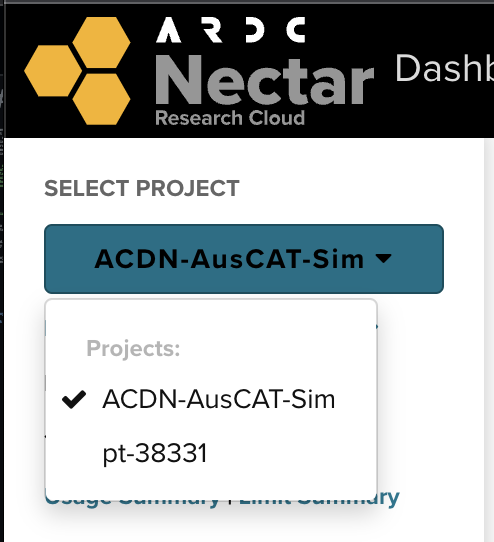
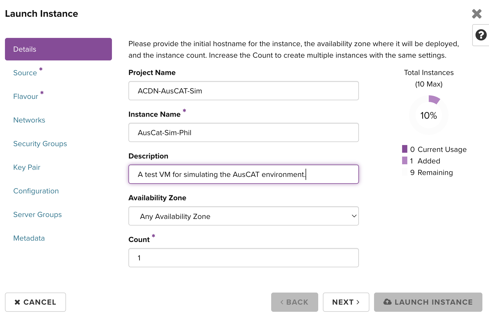
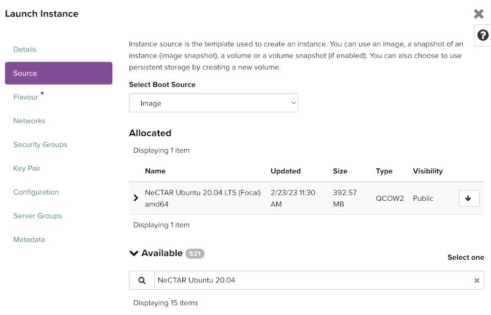
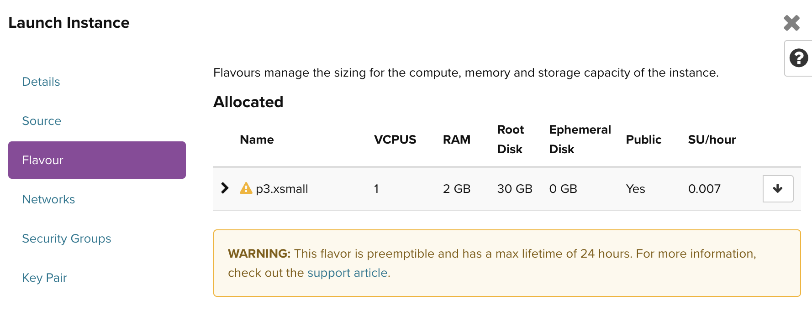
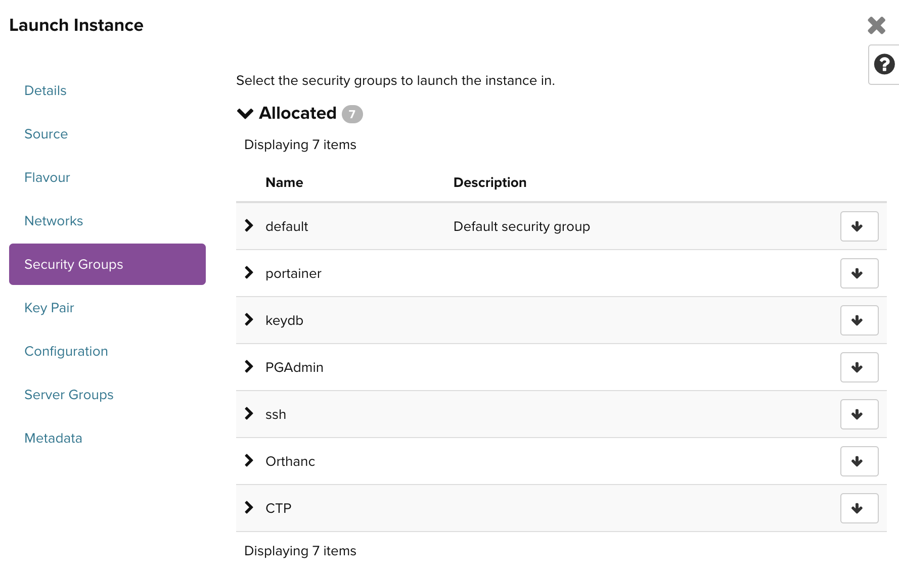
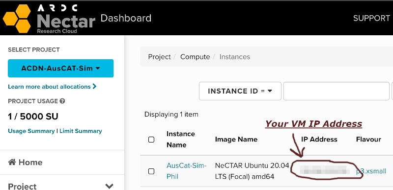
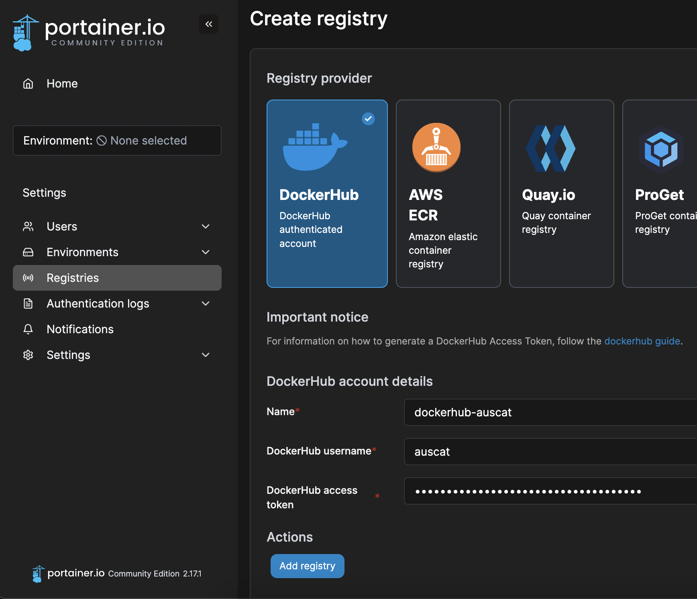
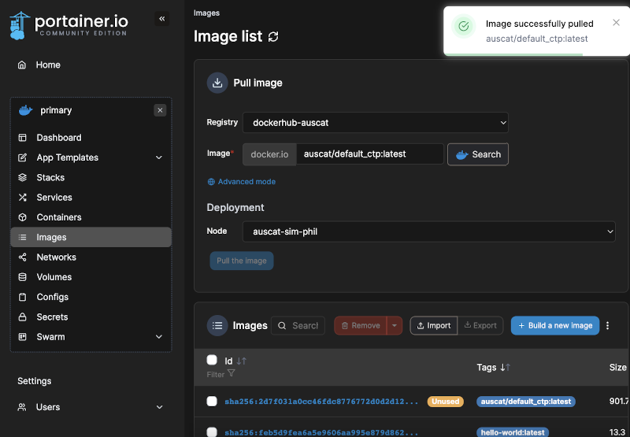
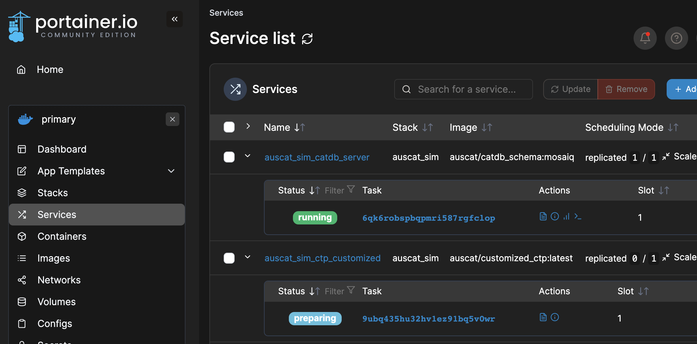

# AusCAT Simulation Environment

To enable learning, development and testing of the AusCAT system a simulation environment can be deployed which loads some public data obtained from The Cancer Imaging Archive. Within this environment the entire system can be run end-to-end to help prepare for deployment of a production ready system at participating centres/sites.

> CAUTION: The simulation environment deals only with public data. Therefore some default passwords are used to enable quick and easy deployment of the simulation setup. These are not suitable for use in a production system and care should be taken to set secure passwords on a production environment.

## What you'll need

To complete the steps in this guide, ensure you have:

- AusCAT Dockerhub access token.
- Unversity affiliated account and access to `ACDN-AusCAT-Sim` project (if intending to use NECTAR cloud).

If you require either of these please contact your AusCAT representative.

## Virtual Machine Setup

### NECTAR Cloud

Perform the following steps to setup a virtual machine on the NECTAR cloud in which to deploy a simulation environment.

1. [Login to NECTAR](https://dashboard.rc.nectar.org.au/project/) using your University affiliation credentials.

2. Switch to the `ACDN-AusCAT-Sim` project.

    

3. Navigate to `Compute->Instances` and press `Launch Instance`

4. Choose an Instance Name, preferably including your name so this can be identified as your VM (e.g. AusCat-Sim-Phil). Press Next.

    

5. Select a Source image for the VM. NECTAR supplies many images from which to create VMs, ideally you will select one based on Ubuntu. The ideal base image, without anything else installed is: `NeCTAR Ubuntu 20.04 LTS (Focal) amd64`. Search for it, press the up arrow to make sure it appears under allocated.

    

6. Next select a flavour. This determines the amount resources that will allocated to the VM. Choose one with a low SU/hour as this is the amount of credits that will be used within our project. If you are experimenting and don't need your VM to stay longer than 24 hours, best to select a preemptible flavour (note the yellow alert symbol) as it will be deleted automatically. Press the up arrow to allocate.



7. Use the default Network settings, press next.

8. Allocate the appropraite predefined security groups (press the up arrow):



9. Generate an SSH keypair and add it to your VM instance. A detailed description on how this is done can be found here: [https://tutorials.rc.nectar.org.au/keypairs/03-ssh-keygen](https://tutorials.rc.nectar.org.au/keypairs/03-ssh-keygen).

10. You're now ready to Launch your Instance!

Wait a few minutes for you VM to be ready. Once built, you can SSH into your VM by finding the IP address assigned:



Then sign in with:

```bash
ssh -i ~/.ssh/your-private-ssh-key.pub ubuntu@your-vm-ip
```

You should now be logged in to your NECTAR VM.

## Docker + Portainer Installation

Now that your VM is up and running, you will need to install Docker and Portainer which will enable deployment of the AusCAT system Docker stack.

### Install Docker

The Docker documentation describes in detail how to install Docker on Ubuntu. Follow the steps here: [https://docs.docker.com/engine/install/ubuntu/](https://docs.docker.com/engine/install/ubuntu/). Don't forget to also run the Linux post-install steps: [https://docs.docker.com/engine/install/linux-postinstall/](https://docs.docker.com/engine/install/linux-postinstall/).

Once Docker is successfully installed, initialise a swarm which will be used in the next step:

```bash
docker swarm init
```

### Install Portainer

Portainer provides a web-interface to manage your Docker instance. It isn't essential but it eases the depolyment process. Ensure you deploy Portainer within Docker swarm to enable additional features for service deployment. Detailed instructions can be found here: [https://docs.portainer.io/start/install-ce/server/swarm/linux](https://docs.portainer.io/start/install-ce/server/swarm/linux).

Once installed (and running, confirm with `docker ps` command), navigate to the Portainer dashbaord in your web browser:

`http://your-vm-ip:9000`

You will be prompted to create a user account the first time you visit this dashboard.

### Add AusCAT Docker Registry

Next you will need add the Dockerhub registry token to Portainer so that you can fetch the required AusCAT images. Navigate to `Registries` in the left menu and click `Add Registry`. Enter the credentials and token you obtained from the AusCAT team:



Test out pulling an image by navigating to `Home`. Then select the `Primary` environment and choose `Images` from the left menu. Try to pull the `auscat/default_ctp:latest` (or any other AusCAT image) from the registry you added. Confirm that the image pull successfully.



## AusCAT Simulation Environment Deployment

### Add orthanc.json Secret

Now you're ready to deploy the AusCAT simulation Docker Stack. You first need to add one Secret within Portainer, this is for the Orthanc contaniner to make the web interface accessible. To do this navigate to `Secrets` and press `Add Secret`. Create a secret with the name `orthanc.json` and add the following to the Secret content:

```json
{
    "Name" : "ORTHANC in AusCAT",
    "RemoteAccessAllowed" : true,
    "AuthenticationEnabled" : true,
    "RegisteredUsers": {
        "admin":"admin"
    }
}
```

Save the Secret.

### Deploy the simulation Docker stack

Next navigate to `Stacks`, press `Add Stack` and enter a suitable name. In the Web editor, insert the AusCAT Simulation Docker Stack:

```yaml
version: "3.8"
services:
  # Postgres Key database service
  keydb_server:
      restart: always
      # Link to the image source from DockerHub
      image: "auscat/keydb_schema:latest"
      # Necessary environment variables
      environment:
        POSTGRES_USER_FILE: /run/secrets/keydb_user # db superuser (pass in from secrets)
        POSTGRES_PASSWORD_FILE: /run/secrets/keydb_pass # db superuser password (pass in from secrets)
        POSTGRES_HOST: localhost # db host
        PGDATA: /var/lib/postgresql/data/pgdata # path to postgres data
        TZ: Australia/Sydney # your machine's timezone
      # postgres data storage location (as a volume)
      volumes:
      - key-pgdata:/var/lib/postgresql/data/
      ports:
      - 5433:5432

  # Postgres Cat database service
  catdb_server:
      restart: always
      # Link to the image source from DockerHub
      image: "auscat/catdb_schema:mosaiq" # Change tag to aria if needed
      # Necessary environment variables
      environment:
        POSTGRES_USER_FILE: /run/secrets/catdb_user # db superuser (pass in from secrets)
        POSTGRES_PASSWORD_FILE: /run/secrets/catdb_pass # db superuser password (pass in from secrets)
        POSTGRES_HOST: localhost # db host
        PGDATA: /var/lib/postgresql/data/pgdata # path to postgres data
        TZ: Australia/Sydney # your machine's timezone
      volumes:
      - cat-pgdata:/var/lib/postgresql/data/
      ports:
      - 5434:5432

  # PG admin service
  pgadmin4:
      # Link to the image source from DockerHub
      image: "dpage/pgadmin4"
      restart: always
      # Necessary environment variables
      environment:
        PGADMIN_DEFAULT_EMAIL: admin@admin.com
        PGADMIN_DEFAULT_PASSWORD: password
      volumes:
      - pgadmin-data:/var/lib/pgadmin
      ports:
      - 5050:80

  # Orthanc service
  orthanc:
      # Link to the image source from DockerHub
      image: "osimis/orthanc:latest"
      ports:
      - 8042:8042 # Browser access port for CTP
      - 4242:4242
      volumes: # 1TB SSD Disk
      - orthanc-data:/var/lib/orthanc/db # Change me
      secrets:
      - orthanc.json

  # Customized CTP server
  ctp_customized:
      # Link to the image source from DockerHub
      image: "auscat/customized_ctp:latest"
      depends_on:
      - keydb_server
      ports:
      - 9090:9090 # Browser access port for CTP
      - 8104:8104
      # CTP logs storage location (CTP logs usually bind mount to your filesystem to access easily on your machine)
      volumes:
      - ctp-logs:/logs

  # RDF4J framework
  rdf4j:
      # Link to the image source from DockerHub
      image: "auscat/rdf4j:latest"
      ports:
      - 8080:8080

  # D2RQ platform
  d2rq:
      image: "auscat/d2rq:latest"
      depends_on:
      - catdb_server
      - rdf4j
      ports:
      - 8888:8888
      volumes:
      - d2rq-data:/home/jovyan/work

  n8n:
      image: 'auscat/n8n:dev'
      ports:
      - 5678:5678
      environment:
        PATIENT_IDS: "LUNG1-001"
        KEYDB_HOST: "keydb_server:5432"
        KEYDB_USERNAME: postgres
        KEYDB_PASSWORD: postgres
        CATDB_HOST: "catdb_server:5432"
        CATDB_USERNAME: postgres
        CATDB_PASSWORD: postgres
        CTP_HOST: "ctp_customized"
      volumes:
      - n8n-data:/home/node/.n8n

secrets:
  orthanc.json:
      external: true

volumes:
  key-pgdata:
  cat-pgdata:
  ctp-customized:
  ctp-logs:
  orthanc-data:
  pgadmin-data:
  d2rq-data:
  n8n-data:
```

Now wait a few minutes while the required images a pulled and the stack is deployed. You can monitor the progress of the containers in the `Services` section (left menu). Here you can see which containers are running or are still `preparing` (being pulled from Dockerhub). Once all containers are `running`, are ready to proceed with the next step.



### Import simulation data
