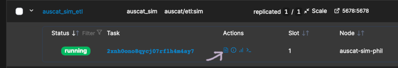

# AusCAT Simulation Environment

To enable learning, development and testing of the AusCAT system a simulation environment can be deployed which loads some public data obtained from The Cancer Imaging Archive. Within this environment the entire system can be run end-to-end to help prepare for deployment of a production ready system at participating centres/sites.

> CAUTION: The simulation environment deals only with public data. Therefore some default passwords are used to enable quick and easy deployment of the simulation setup. These are not suitable for use in a production system and care should be taken to set secure passwords when deployed in a production environment.

## What you'll need

To complete the steps in this guide, ensure you have:

- AusCAT Dockerhub access token.
- Unversity affiliated account and access to `ACDN-AusCAT-Sim` project (if intending to use NECTAR cloud).

If you require either of these please contact your AusCAT representative.

## Virtual Machine Setup

This guide assumes you are using some sort of Virtual Machine (VM running an Ubuntu Operating System. In fact, the system doesn't need to be a Virtual Machine at all, it could be a desktop or laptop computer running Ubuntu.

If your system is no running Ubuntu, you are still able to follow this guide. However you will likely need to explore the Docker documentation in the [Install Docker](#install-docker) step below to determine how to best install Docker for you operating system. Once installed you can follow the remaining instructions in the guide.

### NECTAR Cloud

If you do not already have a Virtual Machine or alternative system in which to install this simulation environment, you may want to use the NECTAR cloud to setup such a Virtual Machine. Note that you will need a University affiliated account and access to the ACDN-AusCAT-Sim Project. Instructions can be [found here](https://github.com/AustralianCancerDataNetwork/auscatverse/blob/main/guides/NECTAR.md).

## Docker + Portainer Installation

Now that your VM is up and running, you will need to install Docker and Portainer which will enable deployment of the AusCAT system Docker stack.

### Install Docker

The Docker documentation describes in detail how to install Docker on Ubuntu. Follow the steps here: [https://docs.docker.com/engine/install/ubuntu/](https://docs.docker.com/engine/install/ubuntu/). Don't forget to also run the Linux post-install steps: [https://docs.docker.com/engine/install/linux-postinstall/](https://docs.docker.com/engine/install/linux-postinstall/).

Once Docker is successfully installed, initialise a swarm which will be used in the next step:

```bash
docker swarm init
```

### Install Portainer

Portainer provides a web-interface to manage your Docker instance. It isn't essential but it eases the depolyment process. Ensure you deploy Portainer within Docker swarm to enable additional features for service deployment. Detailed instructions can be found here: [https://docs.portainer.io/start/install-ce/server/swarm/linux](https://docs.portainer.io/start/install-ce/server/swarm/linux).

Once installed (and running, confirm with `docker ps` command), navigate to the Portainer dashbaord in your web browser:

`http://your-vm-ip:9000`

You will be prompted to create a user account the first time you visit this dashboard.

### Add AusCAT Docker Registry

Next you will need add the Dockerhub registry token to Portainer so that you can fetch the required AusCAT images. Navigate to `Registries` in the left menu and click `Add Registry`. Enter the credentials and token you obtained from the AusCAT team:


Test out pulling an image by navigating to `Home`. Then select the `Primary` environment and choose `Images` from the left menu. Try to pull the `auscat/default_ctp:latest` (or any other AusCAT image) from the registry you added. Confirm that the image was pulled successfully.


## AusCAT Simulation Environment Deployment

### Add orthanc.json Secret

Now you're ready to deploy the AusCAT simulation Docker Stack. You first need to add one Secret within Portainer, this is for the Orthanc contaniner to make the web interface accessible. To do this navigate to `Secrets` and press `Add Secret`. Create a secret with the name `orthanc.json` and add the following to the Secret content:

```json
{
    "Name" : "ORTHANC in AusCAT",
    "RemoteAccessAllowed" : true,
    "AuthenticationEnabled" : true,
    "RegisteredUsers": {
        "admin":"admin"
    }
}
```

Save the Secret.

### Deploy the simulation Docker stack

Next navigate to `Stacks`, press `Add Stack` and enter a suitable name. In the Web editor, insert the AusCAT Simulation Docker Stack:

```yaml
version: "3.8"
services:
  # Postgres Key database service
  keydb_server:
      restart: always
      # Link to the image source from DockerHub
      image: "auscat/keydb_schema:latest"
      # Necessary environment variables
      environment:
        POSTGRES_USER_FILE: /run/secrets/keydb_user # db superuser (pass in from secrets)
        POSTGRES_PASSWORD_FILE: /run/secrets/keydb_pass # db superuser password (pass in from secrets)
        POSTGRES_HOST: localhost # db host
        PGDATA: /var/lib/postgresql/data/pgdata # path to postgres data
        TZ: Australia/Sydney # your machine's timezone
      # postgres data storage location (as a volume)
      volumes:
      - key-pgdata:/var/lib/postgresql/data/
      ports:
      - 5433:5432

  # Postgres Cat database service
  catdb_server:
      restart: always
      # Link to the image source from DockerHub
      image: "auscat/catdb_schema:mosaiq" # Change tag to aria if needed
      # Necessary environment variables
      environment:
        POSTGRES_USER_FILE: /run/secrets/catdb_user # db superuser (pass in from secrets)
        POSTGRES_PASSWORD_FILE: /run/secrets/catdb_pass # db superuser password (pass in from secrets)
        POSTGRES_HOST: localhost # db host
        PGDATA: /var/lib/postgresql/data/pgdata # path to postgres data
        TZ: Australia/Sydney # your machine's timezone
      volumes:
      - cat-pgdata:/var/lib/postgresql/data/
      ports:
      - 5434:5432

  # PG admin service
  pgadmin4:
      # Link to the image source from DockerHub
      image: "dpage/pgadmin4"
      restart: always
      # Necessary environment variables
      environment:
        PGADMIN_DEFAULT_EMAIL: admin@admin.com
        PGADMIN_DEFAULT_PASSWORD: password
      volumes:
      - pgadmin-data:/var/lib/pgadmin
      ports:
      - 5050:80

  # Orthanc service
  orthanc:
      # Link to the image source from DockerHub
      image: "osimis/orthanc:latest"
      ports:
      - 8042:8042 # Browser access port for CTP
      - 4242:4242
      volumes: # 1TB SSD Disk
      - orthanc-data:/var/lib/orthanc/db # Change me
      secrets:
      - orthanc.json

  # Customized CTP server
  ctp_customized:
      # Link to the image source from DockerHub
      image: "auscat/customized_ctp:latest"
      depends_on:
      - keydb_server
      ports:
      - 9090:9090 # Browser access port for CTP
      - 8104:8104
      # CTP logs storage location (CTP logs usually bind mount to your filesystem to access easily on your machine)
      volumes:
      - ctp-logs:/logs

  # RDF4J framework
  rdf4j:
      # Link to the image source from DockerHub
      image: "auscat/rdf4j:latest"
      ports:
      - 8080:8080

  # D2RQ platform
  d2rq:
      image: "auscat/d2rq:latest"
      depends_on:
      - catdb_server
      - rdf4j
      ports:
      - 8888:8888
      volumes:
      - d2rq-data:/home/jovyan/work

  etl:
      image: 'auscat/etl:sim'
      ports:
      - 5678:5678
      environment:
        PATIENT_IDS: "LUNG1-001 LUNG1-002"
        KEYDB_HOST: "keydb_server"
        KEYDB_PORT: 5432
        KEYDB_USERNAME: postgres
        KEYDB_PASSWORD: postgres
        CATDB_HOST: "catdb_server"
        CATDB_PORT: 5432
        CATDB_USERNAME: postgres
        CATDB_PASSWORD: postgres
        CTP_HOST: "ctp_customized"
        CTP_PORT: 8104
        SIMULATION_IMPORT_MODE: auto
      depends_on:
      - catdb_server
      - kaydb_server
      - ctp_customized
      volumes:
      - n8n-data:/home/node/.n8n

secrets:
  orthanc.json:
      external: true

volumes:
  key-pgdata:
  cat-pgdata:
  ctp-customized:
  ctp-logs:
  orthanc-data:
  pgadmin-data:
  d2rq-data:
  n8n-data:
```

Now wait a few minutes while the required images a pulled and the stack is deployed. You can monitor the progress of the containers in the `Services` section (left menu). Here you can see which containers are running or are still `preparing` (being pulled from Dockerhub). Once all containers are `running`, are ready to proceed with the next step.


### Import simulation data

The `etl` Service defined in the stack deployed has an option for `SIMULATION_IMPORT_MODE` which is set to `auto`. Therefore, the script to import the simulation data should run once all Services are up and running. You can inspect the logs of the `etl` service to confirm this completed which you can access using the icon depicted:



You may need to wait some time for the stack to spin up and the simulation data to download and import. Eventually you should see a successful import message in the logs without any errors:


Once data is imported, you can now inspect the data using the PGAdmin tool, as well as CTP and Orthanc. Log in replacing the `[IP_ADDRESS]` with your VM's IP address:

#### PGAdmin

THe PGAdmin tool lets you explore the tabular data in the CatDB and KeyDB databases. Visit `http://[IP_ADDRESS]:5050` in your web browser. The simulation environment username and password to log in are:

- Username: **admin@admin.com**
- Password: **password**

Navigate to the CatDB and inspect the `patient` table (under `CatDB->Databases->cat_db->Schemas->public->Tables`. Right click the `patient` table and choose `View/Edit Data->All Rows`:


Also explore the other tables, including those in the KeyDB to inspect the data that was imported as part of the simulation environment (note this data is quite sparse so most tables will be empty).

#### CTP

The CTP accepts incoming DICOM files for anonymisation before sending them to the Orthanc.Visit `http://[IP_ADDRESS]:9090` in your web browser. Clight login in the top right hand corner, the simulation environment username and password to log in are:

- Username: **admin**
- Password: **123**

Click `DICOM Server Import` in the left menu. Here you can see how many DICOM files the CTP recieved for anoymisation (in the screenshot below this is 377).


#### Orthanc

Orthanc is PACS which stores the anonymised DICOM data. Visit `http://[IP_ADDRESS]:8042` in your web browser. Log in using these simulation environment credentials:

- Username: **admin**
- Password: **admin**

Click `All Patients` and explore the anonymised simulation DICOM data imported.


