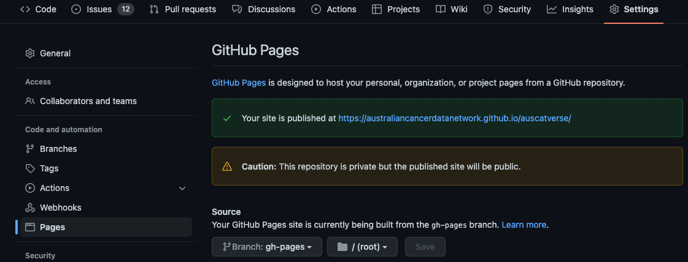

# Sphinx Installation & Setup

This guide outlines the steps required to setup and install Sphinx documentation within our
AusCAT repositories. Appropriate extensions are installed enable using Markdown as the default
documentation syntax. The [Furo theme](https://github.com/pradyunsg/furo) is also applied.

> The following steps assume a unix based operating system (e.g. MacOS or Ubuntu). Steps are likely much the same for Windows but may need to be slightly adapted.

## Install Sphinx

1. Ensure you have a suitable Python environment installed. You may want to [create a new virtual environment](https://docs.python.org/3/tutorial/venv.html) for this project/task. Remember to activate that virtual environment in your terminal before proceeding.

2. Clone the GitHub repository you would like to install the Sphinx for:
`git clone git@github.com:AustralianCancerDataNetwork/auscat-repo-name.git`

3. Create a new branch in which to install sphinx: `git checkout -b sphinx-setup`

4. Define a `requirements.txt` file and add in the following:

```text
sphinx==5.0.2
sphinxcontrib-napoleon==0.7
sphinx-theme==1.0
nbstripout==0.5.0
furo==2022.6.4.1
nbsphinx==0.8.9
m2r2==0.3.2
MarkupSafe==2.0.1
recommonmark==0.7.1
```

5. Install the requirements: `pip install -r requirements.txt`


## Initialise Sphinx

1. Create a new directory called `docs` and change into that directory:

```bash
mkdir docs
cd docs
```

2. Run the Sphinx quickstart command: `sphinx-quickstart`. You will be prompted to enter some information. If unsure you can use the default values suggested.

3. Build the documentation as a website locally: `make html`

4. Open the file in docs/_build/index.html in your web browser to view the documentation.

5. Add a .gitignore file (if there isn't already one). You can generate one at [gitignore.io](https://www.gitignore.io).

6. Add the required extensions to the `conf.py` file:

```python
extensions = [
    "sphinx.ext.autodoc",
    "sphinx.ext.coverage",
    "sphinx.ext.napoleon",
    "nbsphinx",
    "m2r2",
]
```

7. Apply the `furo` theme:

```python
html_theme = 'furo'
```

Build the docs again to check that it's working.

## Enable Markdown Support

The following steps allow Sphinx to render documentation from Markdown files. This simplifies the documentation somewhat and avoids having to learn the reStructuredText syntax which Sphinx uses by default.

1. Near the top of `conf.py`, import some required packages:

```python
import os
import sys
import shutil

from pathlib import Path

sys.path.insert(0, os.path.abspath('..'))
```

2. Near the bottom of `conf.py`, add the following code snippet. This code will allow us to render the Markdown files available in the other repository folders. Some other common file formats needed to render images are also included.

```python
# Define the file extensions we want to copy
extensions_to_copy = ["md", "png", "jpg", "gif"]

# Remove any leftover files from the docs directory first
files = []
for ext in extensions_to_copy:
    files += Path(".").glob(f"**/*.{ext}")
for file in files:
    os.remove(file)

# Copy in the files from the other repository directories to have them
# be rendered by Sphinx
files = []
for ext in extensions_to_copy:
    files += Path("..").glob(f"**/*.{ext}")
for file in files:

    # Only do this for files not in the docs directory
    if file.parts[1] == "docs":
        continue

    target_file = file.relative_to("..")
    target_file.parent.mkdir(parents=True, exist_ok=True)
    shutil.copy(file, target_file)
```

3. Add the following lines to the bottom of the `.gitignore` file since we also don't want to track these copied files:

```text
docs/**/*.md
docs/**/*.png
docs/**/*.jpg
docs/**/*.gif
```

4. In the `index.rst` file, render some Markdown files. You can import the repositories main `README.md` as an example. but here you can begin customisation of the files in this repository and importing them to begin building the documentation.

```restructuredtext
.. mdinclude:: ../README.md

.. toctree::
   :maxdepth: 2
   :caption: Contents:

   README.md
```

Build to documentation again to check that it's working. Now you can start designing and compiling the documentation for this repository.

## Deploying Documentation

GitHub can build and then serve the documentation for us. Unfortunately, only the Enterprise edition of GitHub allows us to properly protect private documentation. Therefore a workaround is required to password protect the Sphinx documentation ourselves. This approach is taken from [this GitHub repository](https://github.com/matteobrusa/Password-protection-for-static-pages).

1. Create a new directory under `docs/site`. Create a new file in there called `index.html` and copy the contents from [here](https://raw.githubusercontent.com/matteobrusa/Password-protection-for-static-pages/master/index.html).

2. Create a GitHub Action pipeline to build the documentation on GitHub by defining the following file under `.github/workflows/build_docs.yml`:

```yaml
name: Build Docs

on: workflow_dispatch

jobs:
  build:
    runs-on: ubuntu-latest

    steps:
    - uses: actions/checkout@v2
    - name: Set up Python
      uses: actions/setup-python@v2
      with:
        python-version: '3.7'
    - name: Install dependencies
      run: |
        python -m pip install --upgrade pip
        pip install -r requirements.txt
        echo "PYTHONPATH=`pwd`" >> $GITHUB_ENV
    - name: Build docs
      run: |
        sudo apt-get update -y && sudo apt-get install -y pandoc
        sphinx-build -b html -a docs docs/site/8b2e19ef880e90b0a9f161dba1af49bb14d68068
    - name: Deploy docs
      uses: peaceiris/actions-gh-pages@v3
      with:
        github_token: ${{ secrets.GITHUB_TOKEN }}
        publish_dir: ./docs/site
```

3. Create a pull request in GitHub to merge you `sphinx-setup` branch into `main`. Once reviewed and approved you may merge the changes through to main.

4. [Create a Personal Access Token](https://docs.github.com/en/authentication/keeping-your-account-and-data-secure/creating-a-personal-access-token) and store it as a secret called GITHUB_TOKEN for this repository.

5. Trigger the workflow under the Actions tab of the GitHub repository. Some further configuration may be required to see the documentation. This can be found under the repository settings under `Pages`. The following image provides an example configuration:



6. If all went well, your documentation should be ready to view.

## More Information

- Sphinx: https://www.sphinx-doc.org/
- Markdown: https://www.markdownguide.org/
- gitignore.io: https://www.gitignore.io

## Help and Support

If you're having any problems with any of these steps please reach out to [Phil](mailto:phillip.chlap@unsw.edu.au) or [Daniel](mailto:d.almouiee@unsw.edu.au).
