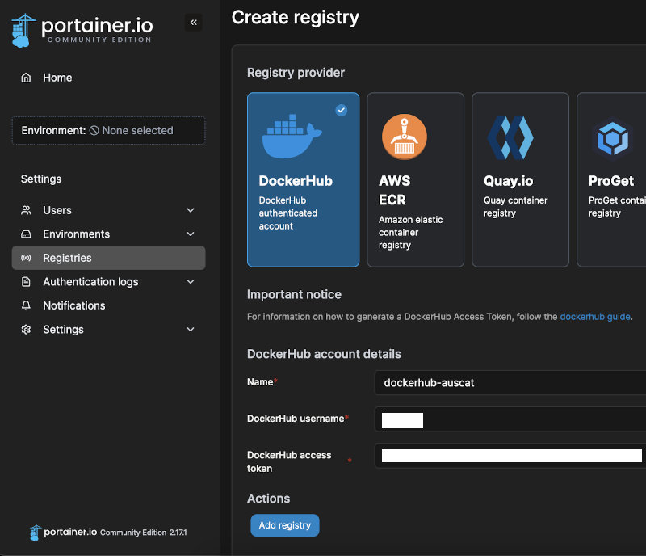
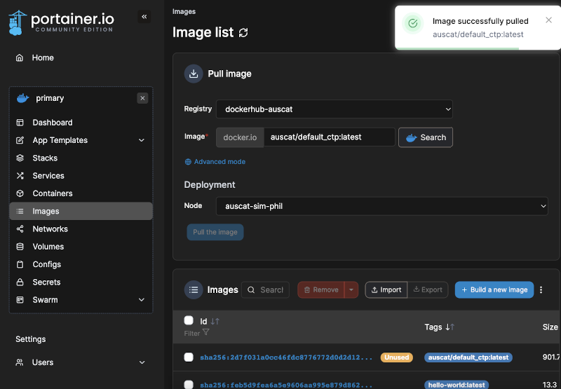

# Docker & Portainer

This document describes how to install Docker and Portainer on a host machine running Ubuntu.

## Install Docker

The Docker documentation describes in detail how to install Docker on Ubuntu: [https://docs.docker.com/engine/install/ubuntu/](https://docs.docker.com/engine/install/ubuntu/). The Linux post-install steps should also be performed: [https://docs.docker.com/engine/install/linux-postinstall/](https://docs.docker.com/engine/install/linux-postinstall/). The following commands are used to install Docker and allow the currently logged in user to execute Docker commands without `sudo` privileges:

### Install required packages

```bash
sudo apt-get update
sudo apt-get install \
    ca-certificates \
    curl \
    gnupg
```

### Add Docker’s official GPG key and setup repository

```bash
sudo mkdir -m 0755 -p /etc/apt/keyrings
curl -fsSL https://download.docker.com/linux/ubuntu/gpg | sudo gpg --dearmor -o /etc/apt/keyrings/docker.gpg
echo \
  "deb [arch="$(dpkg --print-architecture)" signed-by=/etc/apt/keyrings/docker.gpg] https://download.docker.com/linux/ubuntu \
  "$(. /etc/os-release && echo "$VERSION_CODENAME")" stable" | \
  sudo tee /etc/apt/sources.list.d/docker.list > /dev/null
```

### Install Docker Engine

```bash
sudo apt-get update
sudo apt-get install docker-ce docker-ce-cli containerd.io docker-buildx-plugin docker-compose-plugin
```

### Add User to Docker Group

```bash
sudo groupadd docker
sudo usermod -aG docker $USER
newgrp docker
```

#### Test Docker Installation by running `Hello-world` image

```bash
docker run hello-world
```

Once Docker is successfully installed, initialise a swarm which will be used in the next step:

```bash
docker swarm init
```

**If you're using a NECTAR VM with multiple IP addresses assigned, use the following command instead and replace `VM_IP_ADDRESS` with the main IP address you use to connect:**

```bash
docker swarm init --advertise-addr VM_IP_ADDRESS
```

## Install Portainer

Portainer provides a web-interface to manage your Docker instance. It isn't essential but it eases the deployment process. Ensure you deploy Portainer within Docker swarm to enable additional features for service deployment. Detailed instructions can be found here: [https://docs.portainer.io/start/install-ce/server/swarm/linux](https://docs.portainer.io/start/install-ce/server/swarm/linux).

### Fetch Portainer Stack

```bash
curl -L https://downloads.portainer.io/ce2-17/portainer-agent-stack.yml -o portainer-agent-stack.yml
```

### Deploy Portainer

```bash
docker stack deploy -c portainer-agent-stack.yml portainer
```

Once installed (and running, confirm with `docker ps` command), navigate to the Portainer dashboard in your web browser:

`http://your-vm-ip:9000`

You will be prompted to create a user account the first time you visit this dashboard. Ensure you set this immediately after deploying Portainer to avoid a timeout.

## Add AusCAT Docker Registry

Next you will need add the DockerHub registry token to Portainer so that you can fetch the required AusCAT images. Navigate to `Registries` in the left menu and click `Add Registry`. Enter the credentials and token you obtained from the AusCAT team:



Test out pulling an image by navigating to `Home`. Then select the `Primary` environment and choose `Images` from the left menu. Try to pull the `auscat/default_ctp:latest` (or any other AusCAT image) from the registry you added. Confirm that the image was pulled successfully.



## Troubleshooting

**Problem**: Portainer is blocking setting a password due to a timeout.

**Solution**: For security reasons you must set your password immediately after deploying Portainer (Within approximately 2 minutes). If you've missing this Window, restart the portainer container by running the `docker ps` command, finding the name of the `portainer_portainer` container and then running the command `docker restart [portainer_portainer.container.name]`.
