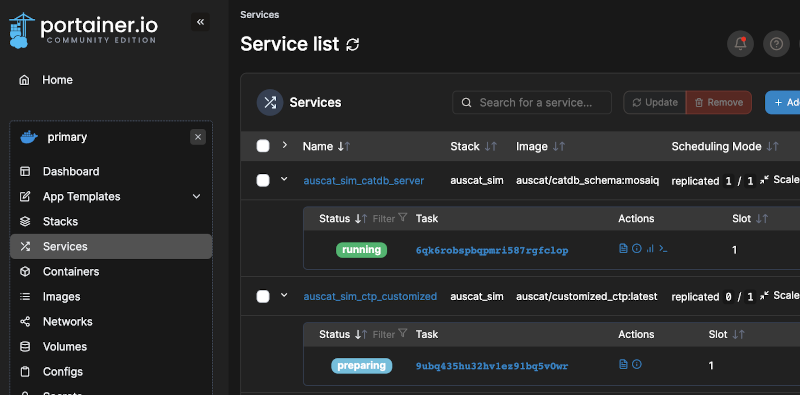
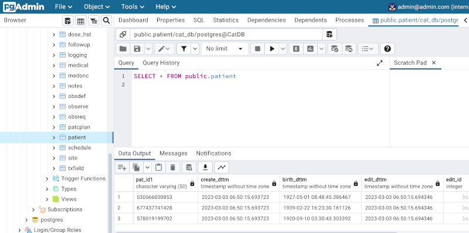
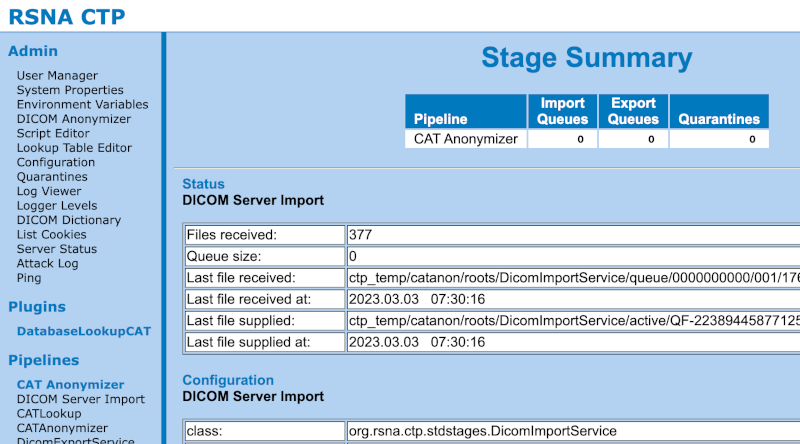
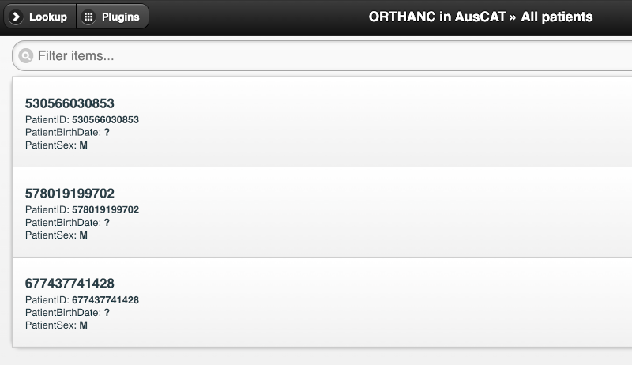

# Simulation Environment Deployment

To enable learning, development and testing of the AusCAT system a simulation environment can be deployed which loads some public data obtained from The Cancer Imaging Archive. Within this environment the entire system can be run end-to-end to help prepare for deployment of a production ready system at participating centres/sites.

> CAUTION: The simulation environment deals only with public data. Therefore some default passwords are used to enable quick and easy deployment of the simulation setup. These are not suitable for use in a production system and care should be taken to set secure passwords when deployed in a production environment.

## What you'll need

To complete the steps in this guide, ensure you have:

- AusCAT Dockerhub access token.
- University affiliated account and access to `ACDN-AusCAT-Sim` project (if intending to use NECTAR cloud).

If you require either of these please contact your AusCAT representative.

## Virtual Machine Setup

This guide assumes you are using some sort of Virtual Machine (VM running an Ubuntu Operating System). In fact, the system doesn't need to be a Virtual Machine at all, it could be a desktop or laptop computer running Ubuntu.

If your system is not running Ubuntu, you are still able to follow this guide. However you will likely need to explore the Docker documentation in [Install Docker](DOCKER_PORTAINER.md) to determine how to best install Docker for your operating system. Once installed you can follow the remaining instructions in the guide.

> **System Requirements**: To run the simulation environment as well as the examples that follow you should have at least 4GB RAM and a 30GB Hard Disk available.

### NECTAR Cloud

If you do not already have a Virtual Machine or alternative system in which to install this simulation environment, you may want to use the NECTAR cloud to setup such a Virtual Machine. Note that you will need a University affiliated account and access to the ACDN-AusCAT-Sim Project. Instructions can be [found here](NECTAR.md).

## Docker + Portainer Installation

Once VM is up and running, you will need to install Docker and Portainer which will enable deployment of the AusCAT system Docker stack. Instructions can be found [here](DOCKER_PORTAINER.md).

## AusCAT Simulation Environment Deployment

Now you're ready to deploy the AusCAT simulation Docker Stack.

### Deploy the simulation Docker stack

Next navigate to `Stacks`, press `Add Stack` and enter a suitable name. In the Web editor, insert the AusCAT Simulation Docker Stack:

```yaml
version: "3.8"
services:
  # Postgres Key database service
  keydb_server:
      restart: always
      # Link to the image source from DockerHub
      image: "auscat/keydb_schema:latest"
      # Necessary environment variables
      environment:
        POSTGRES_USER_FILE: /run/secrets/keydb_user # db superuser (pass in from secrets)
        POSTGRES_PASSWORD_FILE: /run/secrets/keydb_pass # db superuser password (pass in from secrets)
        POSTGRES_HOST: localhost # db host
        PGDATA: /var/lib/postgresql/data/pgdata # path to postgres data
        TZ: Australia/Sydney # your machine's timezone
      # postgres data storage location (as a volume)
      volumes:
      - key-pgdata:/var/lib/postgresql/data/
      ports:
      - 5433:5432

  # Postgres Cat database service
  catdb_server:
      restart: always
      # Link to the image source from DockerHub
      image: "auscat/catdb_schema:mosaiq" # Change tag to aria if needed
      # Necessary environment variables
      environment:
        POSTGRES_USER_FILE: /run/secrets/catdb_user # db superuser (pass in from secrets)
        POSTGRES_PASSWORD_FILE: /run/secrets/catdb_pass # db superuser password (pass in from secrets)
        POSTGRES_HOST: localhost # db host
        PGDATA: /var/lib/postgresql/data/pgdata # path to postgres data
        TZ: Australia/Sydney # your machine's timezone
      volumes:
      - cat-pgdata:/var/lib/postgresql/data/
      ports:
      - 5434:5432

  # PG admin service
  pgadmin4:
      # Link to the image source from DockerHub
      image: "auscat/pgadmin4"
      restart: always
      # Necessary environment variables
      environment:
        PGADMIN_DEFAULT_EMAIL: admin@admin.com
        PGADMIN_DEFAULT_PASSWORD: password
      volumes:
      - pgadmin-data:/var/lib/pgadmin
      ports:
      - 5050:80

  # Orthanc service
  orthanc:
      # Link to the image source from DockerHub
      image: "auscat/orthanc:latest"
      ports:
      - 8042:8042 # Browser access port for CTP
      - 4242:4242
      volumes: # 1TB SSD Disk
      - orthanc-data:/var/lib/orthanc/db # Change me

  # Customized CTP server
  ctp_customized:
      # Link to the image source from DockerHub
      image: "auscat/customized_ctp:latest"
      depends_on:
      - keydb_server
      ports:
      - 9090:9090 # Browser access port for CTP
      - 8104:8104
      # CTP logs storage location (CTP logs usually bind mount to your filesystem to access easily on your machine)
      volumes:
      - ctp-logs:/logs

  # RDF4J framework
  rdf4j:
      # Link to the image source from DockerHub
      image: "auscat/rdf4j:latest"
      ports:
      - 8080:8080

  # D2RQ platform
  # d2rq:
  #     image: "auscat/d2rq:latest"
  #     depends_on:
  #     - catdb_server
  #     - rdf4j
  #     ports:
  #     - 8888:8888
  #     volumes:
  #     - d2rq-data:/home/jovyan/work

  etl:
      image: 'auscat/etl:sim'
      ports:
      - 5678:5678
      environment:
        PATIENT_IDS: "LUNG1-001 LUNG1-002"
        KEYDB_HOST: "keydb_server"
        KEYDB_PORT: 5432
        KEYDB_USERNAME: postgres
        KEYDB_PASSWORD: postgres
        CATDB_HOST: "catdb_server"
        CATDB_PORT: 5432
        CATDB_USERNAME: postgres
        CATDB_PASSWORD: postgres
        CTP_HOST: "ctp_customized"
        CTP_PORT: 8104
        SIMULATION_IMPORT_MODE: auto
      depends_on:
      - catdb_server
      - keydb_server
      - ctp_customized
      volumes:
      - n8n-data:/home/node/.n8n

  analysis_example:
      image: "auscat/etl:example"
      ports:
      - 8888:8888
      depends_on:
      - etl
      volumes:
      - analysis-data:/data

volumes:
  key-pgdata:
  cat-pgdata:
  ctp-customized:
  ctp-logs:
  orthanc-data:
  pgadmin-data:
  d2rq-data:
  n8n-data:
  analysis-data:
```

Now wait a few minutes while the required images are pulled and the stack is deployed. You can monitor the progress of the containers in the `Services` section (left menu). Here you can see which containers are running or are still `preparing` (being pulled from Dockerhub). Once all containers are `running`, you are ready to proceed with the next step.



### Import simulation data

The `etl` Service defined in the stack deployed has an option for `SIMULATION_IMPORT_MODE` which is set to `auto`. Therefore, the script to import the simulation data should run once all Services are up and running. You can inspect the logs of the `etl` service to confirm this completed which you can access using the icon depicted:


You may need to wait some time for the stack to spin up and the simulation data to download and import. Eventually you should see a successful import message in the logs without any errors:


Once data is imported, you can now inspect the data using the PGAdmin tool, as well as CTP and Orthanc. Log in replacing the `[IP_ADDRESS]` with your VM's IP address:

#### PGAdmin

The PGAdmin tool lets you explore the tabular data in the CatDB and KeyDB databases. Visit `http://[IP_ADDRESS]:5050` in your web browser. The simulation environment username and password to log in are:

- Username: **admin@admin.com**
- Password: **password**

Navigate to the CatDB and inspect the `patient` table (under `CatDB->Databases->cat_db->Schemas->public->Tables`). Right click the `patient` table and choose `View/Edit Data->All Rows`:



Also explore the other tables, including those in the KeyDB to inspect the data that was imported as part of the simulation environment (note this data is quite sparse so most tables will be empty).

#### CTP

The CTP accepts incoming DICOM files for anonymisation before sending them to the Orthanc. Visit `http://[IP_ADDRESS]:9090` in your web browser. Click login in the top right hand corner, the simulation environment username and password to log in are:

- Username: **admin**
- Password: **123**

Click `DICOM Server Import` in the left menu. Here you can see how many DICOM files the CTP received for anonymisation (in the screenshot below this is 377).



#### Orthanc

Orthanc is PACS which stores the anonymised DICOM data. Visit `http://[IP_ADDRESS]:8042` in your web browser. Log in using these simulation environment credentials:

- Username: **admin**
- Password: **admin**

Click `All Patients` and explore the anonymised simulation DICOM data imported.


